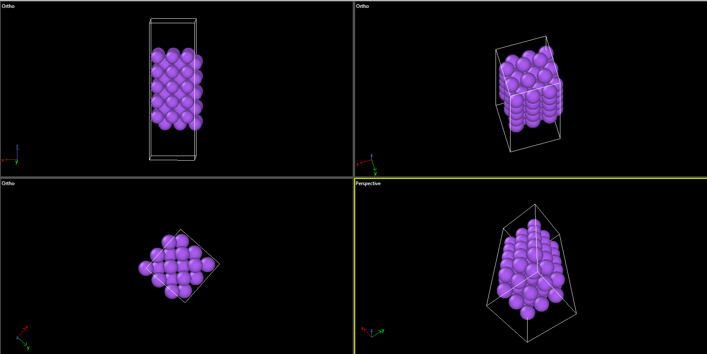

# Na-SEI-AIMD-MLIP
AIMD and machine-learning interatomic potential study of SEI formation on Na(100) in sodium-ion battery electrolytes.
## Overview

This project investigates the formation and evolution of the
solid-electrolyte interphase (SEI) at a sodium metal/electrolyte
interface using first-principles calculations, ab initio molecular
dynamics (AIMD), and machine-learning interatomic potentials (MLIPs).

The initial model focuses on the interaction between a Na(100) surface
and ethylene carbonate (EC).

## Research Objective

The main objective is to investigate how electrolyte molecules interact
with and decompose at a sodium surface, and to develop a machine-learning
interatomic potential capable of extending the timescale of reactive
molecular dynamics beyond conventional DFT-based AIMD.

## Computational Workflow

Na(100) surface
        ↓
DFT calculations
        ↓
AIMD simulations
        ↓
DFT configuration dataset
        ↓
ML interatomic potential
        ↓
Long-timescale ML-MD
        ↓
SEI formation and structural analysis

## Initial Model

The initial computational model consists of a 3×3 Na(100) surface
constructed from bulk BCC sodium.



## Tools

- Python
- ASE
- VASP
- OVITO
- MACE
- Git/GitHub

## Project Status

🚧 **Work in progress**

### Current milestone

- Computational environment established
- BCC Na structure generated using ASE
- Na(100) surface model generated
- 3×3 Na(100) surface supercell constructed
- VASP 6.6.0 successfully tested on the HPC cluster

## Repository Structure

```text
docs/       Research notes and daily progress
scripts/    Python and computational workflow scripts
structures/ Atomic structures used in the study
figures/    Important figures and visualizations
