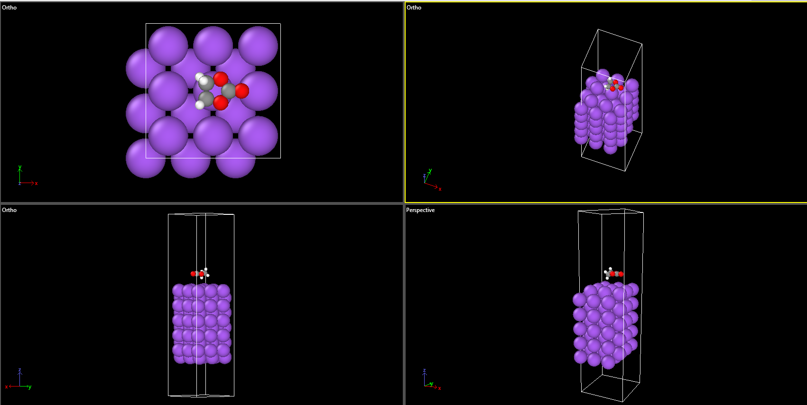

# Day 05 - Initial Na(100)/EC Interface Construction

## Overview

Day 05 focused on constructing and inspecting the initial Na(100)/EC interface using the converged Na(100) slab and optimized ethylene carbonate (EC) molecule obtained during Day 04.

---

## 1. Initial Interface Construction

The interface was constructed using the final relaxed structures:

- `structures/POSCAR_Na100_3x3_final`
- `structures/POSCAR_EC_relaxed`

The interface was generated using the Python script:

`scripts/build_interface.py`

### Interface parameters

- Na(100) slab: 90 Na atoms
- EC molecule: 10 atoms
- Total atoms: 100
- Initial Na-EC separation: 3.5 A
- Vacuum above EC: 15.0 A
- Final cell height: 49.65 A
- Periodic boundary conditions: x and y directions

The resulting initial interface was saved as:

`structures/POSCAR_Na100_EC_initial`

---

## 2. Visual Inspection

The initial Na(100)/EC interface was inspected using OVITO.

The inspection confirmed:

- The Na(100) slab remained structurally intact.
- EC was positioned above the Na surface.
- EC was approximately centered over the 3x3 surface.
- No obvious Na-EC atomic overlap was observed.
- Sufficient vacuum was present above the EC molecule.

The initial interface visualization is shown below.

---

## 3. Milestone

At this stage:

- Final Na(100) slab available.
- Relaxed EC molecule available.
- Initial Na(100)/EC interface successfully constructed.
- Interface geometry visually inspected in OVITO.

### Next milestone

Perform DFT geometry optimization of the Na(100)/EC interface.