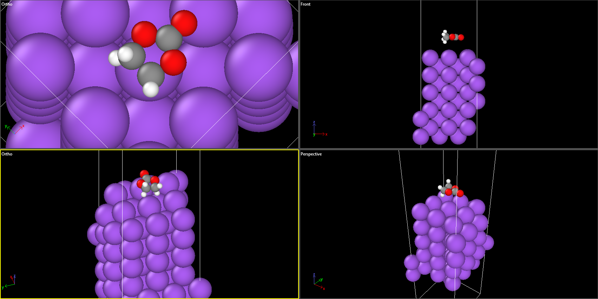

# Day 08 - DFT Functional Screening for Na/EC

## Overview

Day 08 focused on establishing a consistent production DFT methodology before rebuilding the Na(100)/EC model for AIMD.

## 1. Freeze-Layer Validation

The original Na(100)/EC relaxation was found to contain an incorrect constraint pattern.

The 27 frozen Na atoms were distributed across all Na layers rather than corresponding to the bottom three layers. Therefore, the original constraints are not suitable for AIMD and the slab must be rebuilt with height-based layer selection.

**Figure 1.** Relaxed Na(100)/EC interface used as the reference geometry during the functional-screening stage.

## 2. Na Bulk Functional Screening

Initial bulk tests showed strong contraction with PBE+D3(BJ), so additional dispersion treatments were screened.

A second screening was performed consistently using the Na_pv POTCAR.

### Na_pv equilibrium lattice constants

| Functional | a0 (Angstrom) |
|---|---:|
| PBE | 4.19547 |
| PBE+D3 zero damping | 4.16202 |
| optB86b-vdW | 4.17666 |
| rev-vdW-DF2 | 4.16805 |

D3(BJ) gave 4.07805 Angstrom in the earlier bulk test and was excluded from further consideration because of its stronger contraction.

D4 was also tested but is unavailable in the current VASP build because the executable was not compiled with DFTD4 support.

## 3. Spin-Polarization Compatibility

An optB86b-vdW spin-polarized single-point test was completed successfully.

The final magnetic moment was approximately:

mag = -0.0003 mu_B

This confirms that the optB86b-vdW setup is compatible with ISPIN = 2 on the current AhmedLab VASP environment.

## 4. Fixed-Geometry Na/EC Interaction Screen

A controlled single-point comparison was performed using the same Na/EC geometry, Na_pv/O/C/H POTCARs, numerical settings, and corresponding functional for the interface, Na slab, and EC components.

The interaction energy was evaluated as:

E_int = E_interface - E_Na_slab - E_EC

### Interaction energies

| Functional | E_int (eV) |
|---|---:|
| PBE | -0.089857 |
| PBE+D3 zero damping | -0.153635 |
| optB86b-vdW | -0.193608 |
| rev-vdW-DF2 | -0.159933 |

These values are fixed-geometry interaction energies and are used only for functional screening.

The interface geometry used in this comparison originated from the earlier PBE+D3(BJ) relaxation with the original 4.29 Angstrom in-plane lattice. Therefore, these values are not production adsorption energies.

## Milestone

A consistent set of candidate DFT methods was established, and optB86b-vdW passed the initial bulk and spin-compatibility checks.

## Next Milestone

Validate the organic/condensed-phase side, then finalize the production functional and rebuild the Na(100)/EC slab using the correct lattice parameter and height-based frozen layers.
