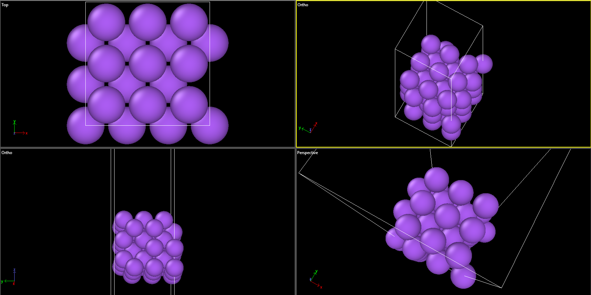

# Day 10 - Rebuilt Na(100) Substrate

## Overview

Day 10 began the reconstruction of the AIMD-ready Na(100) model using the selected optB86b-vdW production methodology.

The previous 90-atom slab was not used because its frozen atoms were distributed through the slab rather than corresponding to complete bottom layers.

## 1. Rebuilt Slab

The new Na(100) slab was constructed with:

- optB86b-vdW lattice parameter: a0 = 4.176663 Angstrom
- 3 x 3 surface cell
- 6 Na(100) layers
- 9 Na atoms per layer
- 54 Na atoms total
- bottom 2 layers frozen
- upper 4 layers free

The resulting surface dimensions are approximately:

12.529989 x 12.529989 Angstrom

## 2. Constraint Validation

The frozen atoms were assigned by atomic height rather than atom index.

The final constraint pattern is:

- Layer 1: 9 frozen
- Layer 2: 9 frozen
- Layer 3: 9 free
- Layer 4: 9 free
- Layer 5: 9 free
- Layer 6: 9 free

Thus, the bottom two complete Na layers are frozen and all upper surface layers remain mobile.

## 3. DFT Relaxation

The slab was relaxed using:

- Na_pv POTCAR
- optB86b-vdW
- ENCUT = 500 eV
- Gamma-centered 3 x 3 x 1 k-point mesh
- ISIF = 2
- EDIFFG = -0.02 eV/Angstrom
- LDIPOL = .TRUE.
- IDIPOL = 3

VASP reported successful structural convergence.

Final forces:

- Maximum force = 0.018855 eV/Angstrom
- RMS force = 0.012398 eV/Angstrom

## 4. Final Layer Positions

After relaxation, the layer positions were:

- Layer 1: 10.000 Angstrom
- Layer 2: 12.088 Angstrom
- Layer 3: 14.191 Angstrom
- Layer 4: 16.251 Angstrom
- Layer 5: 18.329 Angstrom
- Layer 6: 20.461 Angstrom

The slab remained coherent with no obvious pathological reconstruction in OVITO.

## Milestone

A converged and correctly constrained 6-layer Na(100) substrate was obtained.

Final structure:

POSCAR_Na100_6layer_optb86b_relaxed

## Next Milestone

Construct the corrected Na(100)/EC interface using the relaxed 54-atom slab and the relaxed EC molecule.

**Figure 1.** Relaxed six-layer Na(100) slab used as the substrate for the rebuilt Na/EC interface.
